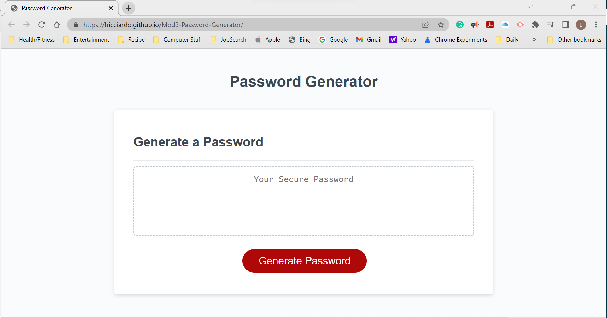
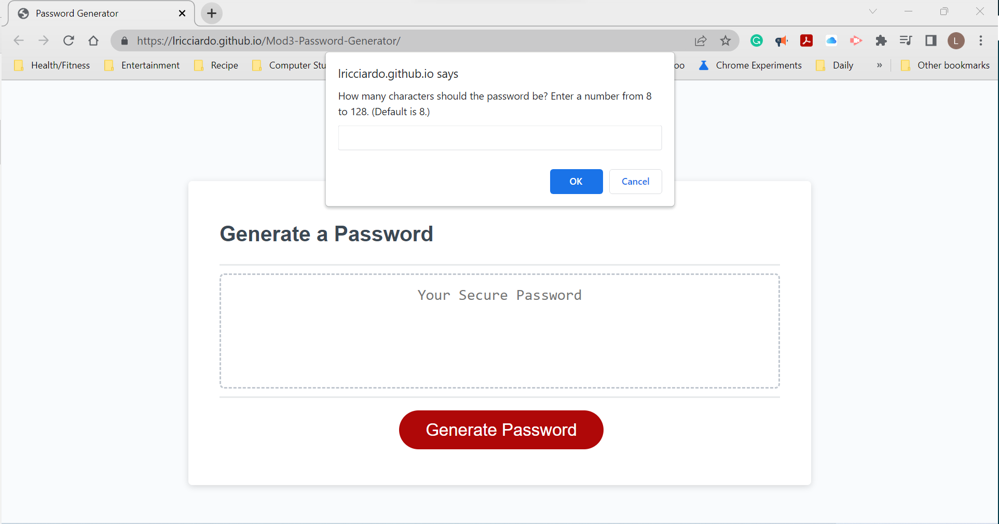

# Mod3-Password-Generator

Mod 3 Challenge Password Generator creates a random password between 8 to 128 chars. This application will be useful to create passwords for more secure access to your sites.

I learned how to ask the user for information and write the respose out for the user to read. I learned more on how to manipulate arrays and strings. And I learned more on how functions react and interact with other functions. I know I have much more to learn.

## Installation

No Installation is required.

## Usage

To use this application, visit the URL: (https://lricciardo.github.io/Mod3-Password-Generator/).

When the user clicks on the (Generate Password) button, the application will prompt the user for the password criteria. If none is entered or invalid data is enetered, the default values will be used.

The default password criteria is:
-- How many characters should the password be? Enter a number from 8 to 128. (Default is 8.)
-- Do you want Lowercase characters? Enter "Y" for Yes or "N" for No. (Default is Yes.)'
-- Do you want Uppercase characters? Enter "Y" for Yes or "N" for No. (Default is Yes.)'
-- Do you want Numeric characters? Enter "Y" for Yes or "N" for No. (Default is Yes.)'
-- Do you want Special characters? Enter "Y" for Yes or "N" for No. (Default is Yes.)'

Here is a screenshot when URL is opened: 

---

Here is a screenshot of the first user prompt:

---

The final screen is waiting your arrival.

## Credits

Melissa (TA) helped me understand the UI prompts and the how the generate button works so Kudos to Melissa.

## License

Refer to license on the GitHub repository

---
